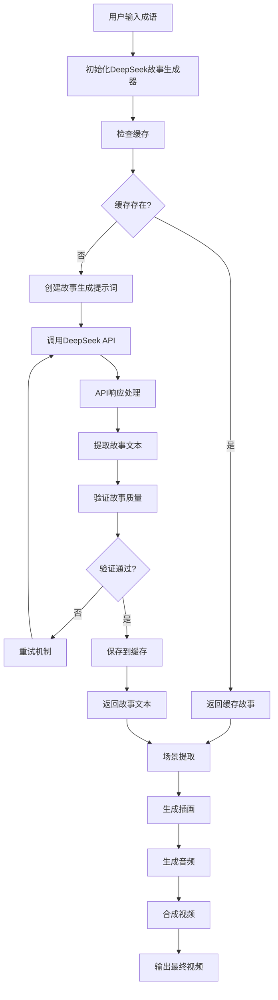
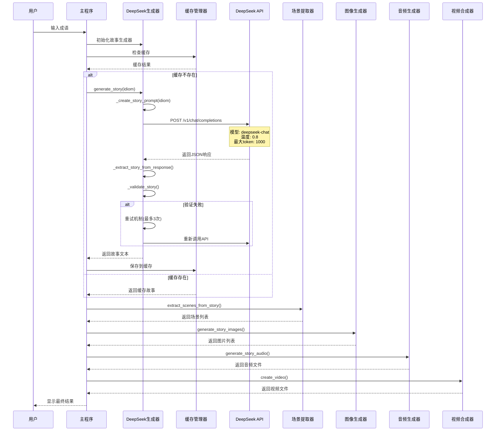
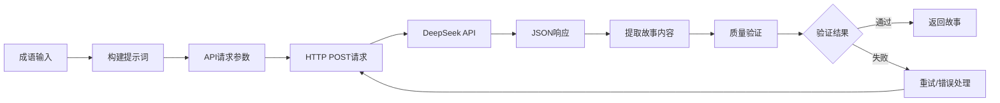
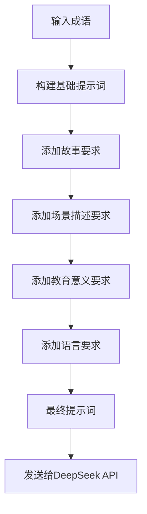
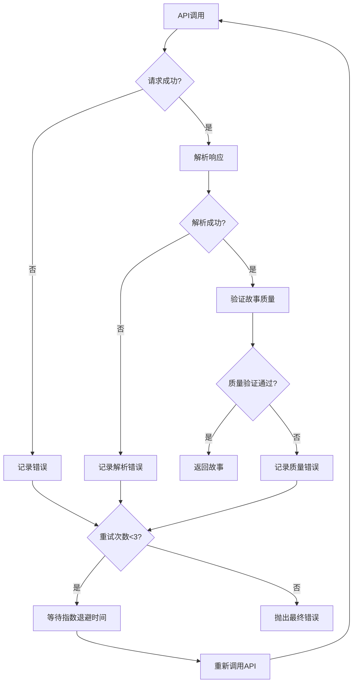
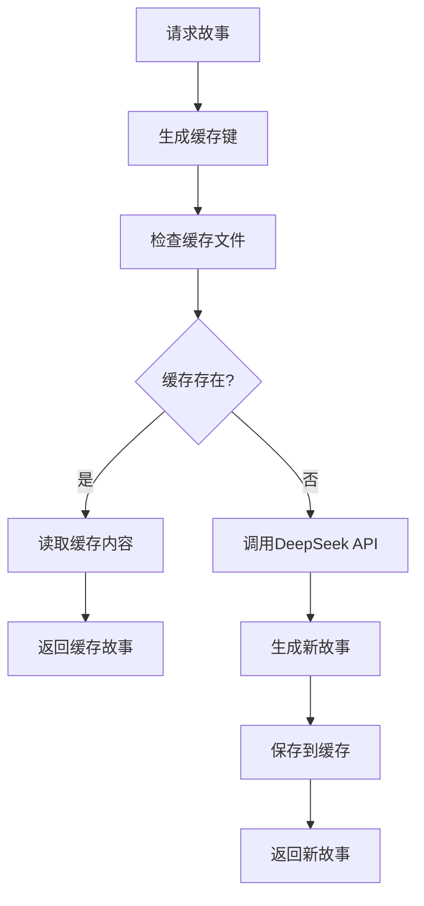

# 成语故事短视频生成系统 - DeepSeek调用流程图

## 整体流程图

## 详细调用流程

## DeepSeek API调用详情

## 提示词构建流程

## 错误处理和重试机制

## 缓存机制

## 技术参数配置

### DeepSeek API参数
- **模型**: `deepseek-chat`
- **温度**: `0.8` (控制创造性)
- **最大Token**: `1000`
- **Top-p**: `0.9` (核采样)
- **频率惩罚**: `0.1`
- **存在惩罚**: `0.1`
- **超时时间**: `30秒`

### 重试机制
- **最大重试次数**: `3次`
- **退避策略**: 指数退避 (2^attempt秒)
- **错误类型**: 网络错误、JSON解析错误、质量验证失败

### 缓存策略
- **缓存键格式**: `story_{idiom}_{hash}`
- **缓存位置**: `./cache/`
- **缓存格式**: Pickle文件
- **缓存有效期**: 永久（手动清理）

## 故事质量验证标准

1. **长度检查**: 不超过500字
2. **内容检查**: 包含基本故事元素
3. **结构检查**: 有明确的开始、发展、结尾
4. **语言检查**: 符合儿童阅读水平
5. **场景检查**: 包含丰富的视觉描述

## 输出格式

- **故事文本**: 纯文本格式
- **场景列表**: JSON数组格式
- **图片文件**: JPG格式，保存在`output_pic/`
- **音频文件**: MP3格式
- **视频文件**: MP4格式，保存在`output/`

