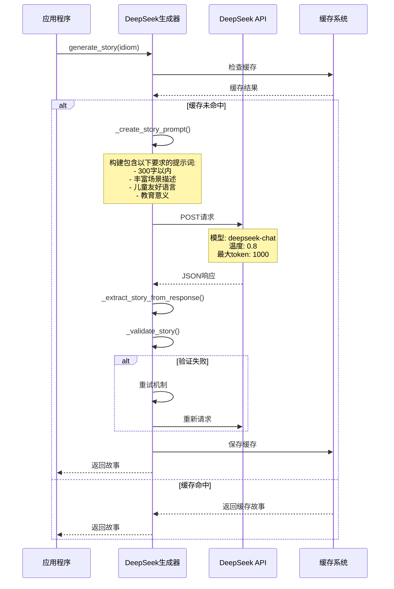

# DeepSeek API调用流程简图

## 核心调用流程


## DeepSeek API调用详情



## 提示词构建过程


## 错误处理流程


## 关键代码调用链

```
main.py:process_single_idiom()
  └── main.py:generate_story_text()
      └── story_generator.py:generate_story()
          ├── _create_story_prompt()
          ├── _call_api()
          ├── _extract_story_from_response()
          └── _validate_story()
```

## API请求参数详解

```json
{
  "model": "deepseek-chat",
  "messages": [
    {
      "role": "user", 
      "content": "请为成语'守株待兔'创作一个适合3-8岁儿童阅读的故事..."
    }
  ],
  "temperature": 0.8,
  "max_tokens": 1000,
  "top_p": 0.9,
  "frequency_penalty": 0.1,
  "presence_penalty": 0.1
}
```

## 响应处理流程

```
API响应 → JSON解析 → 提取choices[0].message.content → 去除首尾空白 → 质量验证 → 返回故事文本
```

## 缓存机制

- **缓存键**: `story_{idiom}_{md5_hash}`
- **存储位置**: `./cache/`
- **文件格式**: `.pkl`
- **生命周期**: 永久存储，手动清理


