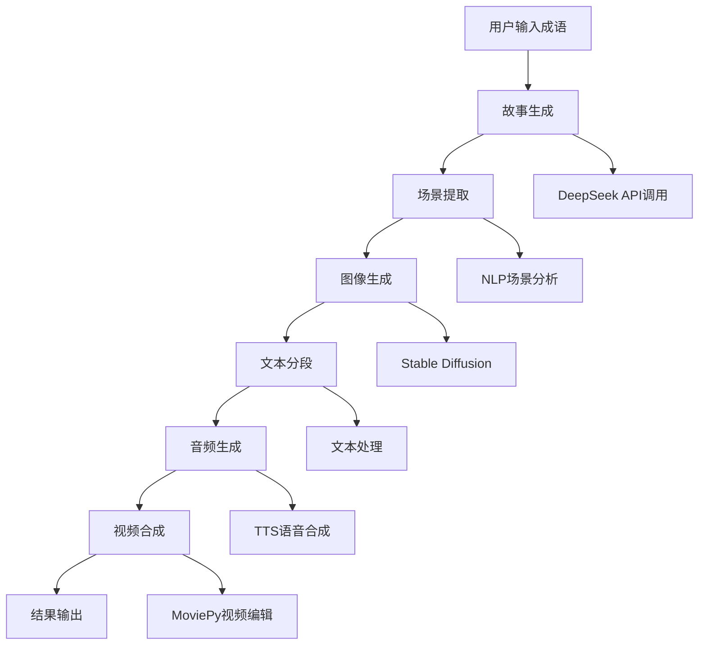

# 成语故事短视频生成系统 - 技术报告

## 📋 项目概述

**项目名称**：成语故事短视频生成系统 (Idoms2video)  
**开发时间**：2024年9月  
**技术栈**：Python + AI + Web  
**项目类型**：AI驱动的短视频内容生成系统  

### 🎯 项目目标
基于人工智能技术，自动生成适合儿童观看的成语故事短视频，包含故事文本、插画、音频和视频制作，支持批量处理和平台发布。

---

## 🏗️ 系统架构

### 核心模块架构图

```
成语故事短视频生成系统
├── 用户界面层 (Streamlit Web)
│   ├── 输入界面
│   ├── 编辑界面  
│   └── 结果展示
├── 业务逻辑层
│   ├── 故事生成器 (DeepSeek API)
│   ├── 场景提取器 (NLP)
│   ├── 图像生成器 (Stable Diffusion)
│   ├── 文本分段器
│   ├── 音频生成器 (TTS)
│   └── 视频合成器 (MoviePy)
├── 数据存储层
│   ├── 缓存系统
│   ├── 文件存储
│   └── 日志系统
└── 外部服务层
    ├── DeepSeek API
    ├── Hugging Face Hub
    └── 本地AI模型
```

---

## 📦 技术依赖分析

### 核心依赖包

#### 🤖 AI和机器学习
| 包名 | 版本 | 用途 | 重要性 |
|------|------|------|--------|
| `transformers` | ≥4.30.0 | Hugging Face模型库 | ⭐⭐⭐⭐⭐ |
| `diffusers` | ≥0.20.0 | Stable Diffusion管道 | ⭐⭐⭐⭐⭐ |
| `torch` | ≥2.0.0 | PyTorch深度学习框架 | ⭐⭐⭐⭐⭐ |
| `accelerate` | ≥0.20.0 | 模型加速库 | ⭐⭐⭐⭐ |
| `xformers` | ≥0.0.20 | 内存优化注意力机制 | ⭐⭐⭐ |

#### 🎨 图像处理
| 包名 | 版本 | 用途 | 重要性 |
|------|------|------|--------|
| `Pillow` | ≥9.5.0 | 图像处理基础库 | ⭐⭐⭐⭐⭐ |
| `opencv-python` | ≥4.8.0 | 计算机视觉 | ⭐⭐⭐ |
| `imageio` | ≥2.31.0 | 图像I/O | ⭐⭐⭐ |
| `numpy` | ≥1.24.0 | 数值计算 | ⭐⭐⭐⭐⭐ |

#### 🔊 音频处理
| 包名 | 版本 | 用途 | 重要性 |
|------|------|------|--------|
| `pydub` | ≥0.25.1 | 音频处理 | ⭐⭐⭐⭐ |
| `librosa` | ≥0.10.0 | 音频分析 | ⭐⭐⭐ |
| `gTTS` | ≥2.3.0 | Google文本转语音 | ⭐⭐⭐⭐ |
| `pygame` | ≥2.5.0 | 音频播放 | ⭐⭐⭐ |

#### 🎬 视频处理
| 包名 | 版本 | 用途 | 重要性 |
|------|------|------|--------|
| `moviepy` | ≥1.0.3 | 视频编辑合成 | ⭐⭐⭐⭐⭐ |
| `ffmpeg-python` | ≥0.2.0 | FFmpeg Python接口 | ⭐⭐⭐⭐ |

#### 🌐 Web和API
| 包名 | 版本 | 用途 | 重要性 |
|------|------|------|--------|
| `streamlit` | ≥1.25.0 | Web界面框架 | ⭐⭐⭐⭐⭐ |
| `requests` | ≥2.31.0 | HTTP请求 | ⭐⭐⭐⭐ |
| `fastapi` | ≥0.100.0 | API框架 | ⭐⭐⭐ |
| `uvicorn` | ≥0.23.0 | ASGI服务器 | ⭐⭐⭐ |

#### 🛠️ 工具库
| 包名 | 版本 | 用途 | 重要性 |
|------|------|------|--------|
| `loguru` | ≥0.7.0 | 日志系统 | ⭐⭐⭐⭐ |
| `python-dotenv` | ≥1.0.0 | 环境变量管理 | ⭐⭐⭐⭐ |
| `tqdm` | ≥4.65.0 | 进度条 | ⭐⭐⭐ |
| `pydantic` | ≥2.0.0 | 数据验证 | ⭐⭐⭐ |

---

## 🗂️ 项目文件结构

```
Idoms2video/
├── 📁 核心文件
│   ├── main.py                    # 主程序入口 (Streamlit应用)
│   ├── config.py                  # 配置管理
│   ├── utils.py                   # 工具函数
│   └── simple_video_composer.py   # 简化视频合成器
│
├── 📁 模块目录 (modules/)
│   ├── __init__.py
│   ├── story_generator.py         # 故事生成模块 (DeepSeek API)
│   ├── scene_extractor.py         # 场景提取模块 (NLP)
│   ├── image_generator.py         # 图像生成模块 (Stable Diffusion)
│   ├── text_segmenter.py          # 文本分段模块
│   ├── audio_generator.py         # 音频生成模块 (TTS)
│   └── video_composer.py          # 视频合成模块 (MoviePy)
│
├── 📁 数据目录
│   ├── output/                    # 视频输出目录
│   ├── output_pic/                # 图片输出目录
│   ├── temp/                      # 临时文件目录
│   ├── cache/                     # 缓存目录
│   └── logs/                      # 日志目录
│
├── 📁 模型目录 (models/)
│   └── models--runwayml--stable-diffusion-v1-5/  # Stable Diffusion模型
│
├── 📁 配置文件
│   ├── requirements.txt           # Python依赖
│   ├── .env.example              # 环境变量示例
│   ├── .gitignore                # Git忽略文件
│   └── README.md                 # 项目说明
│
└── 📁 测试文件
    ├── test_*.py                 # 各种测试脚本
    └── debug_*.py                # 调试脚本
```

---

## 🔄 系统工作流程

### 完整处理流程



### 详细处理步骤

1. **输入处理** 📝
   - 用户通过Web界面输入成语
   - 支持单个成语、成语列表、文件上传
   - 输入验证和预处理

2. **故事生成** 📚
   - 调用DeepSeek API生成适合儿童的故事
   - 故事长度控制在500-800字
   - 包含教育意义和趣味性

3. **场景提取** 🎭
   - 使用NLP技术分析故事文本
   - 提取15个关键场景
   - 生成场景描述文本

4. **图像生成** 🎨
   - 基于Stable Diffusion生成插画
   - 每个场景生成一张高质量图片
   - 支持卡通风格和儿童友好设计

5. **音频生成** 🔊
   - 文本分段处理
   - TTS语音合成
   - 生成旁白和角色配音

6. **视频合成** 🎬
   - 图片序列处理
   - 音频同步
   - 生成1080x1920竖屏视频

7. **结果输出** 📤
   - 保存到指定目录
   - 生成元数据
   - 准备平台发布

---

## ⚡ 性能优化

### GPU加速优化
- **CUDA支持**：充分利用RTX 5060显卡
- **内存优化**：启用CPU卸载和注意力切片
- **精度优化**：使用float16减少显存占用
- **批处理**：优化推理步数和引导强度

### 缓存机制
- **故事缓存**：避免重复API调用
- **图像缓存**：复用已生成的图片
- **模型缓存**：本地存储AI模型

### 错误处理
- **网络重试**：Hugging Face连接超时处理
- **版本兼容**：MoviePy API兼容性处理
- **内存管理**：防止内存溢出

---

## 🎯 核心功能特性

### ✅ 已实现功能

1. **智能故事生成** 🧠
   - DeepSeek API集成
   - 儿童友好的故事风格
   - 教育意义和趣味性并重

2. **自动插画生成** 🎨
   - Stable Diffusion v1.5
   - 卡通风格插画
   - 高质量图像输出

3. **语音合成** 🔊
   - Google TTS集成
   - 自然语音效果
   - 多语言支持

4. **视频制作** 🎬
   - MoviePy视频合成
   - 竖屏格式适配
   - 音频同步处理

5. **Web界面** 🌐
   - Streamlit响应式界面
   - 实时进度显示
   - 用户友好交互

6. **批量处理** 📦
   - 多成语批量生成
   - 文件上传支持
   - 进度跟踪

### 🚧 待优化功能

1. **平台发布** 📱
   - 抖音API集成
   - 快手API集成
   - 自动发布功能

2. **高级编辑** ✏️
   - 故事内容编辑
   - 图片风格调整
   - 音频效果优化

3. **模板系统** 📋
   - 多种视频模板
   - 自定义样式
   - 品牌元素集成

---

## 📊 技术指标

### 性能指标
- **图像生成速度**：30-40秒/张 (RTX 5060)
- **视频合成时间**：2-3分钟 (40秒视频)
- **内存使用**：8-12GB (GPU模式)
- **存储需求**：20GB+ (包含模型)

### 质量指标
- **图像分辨率**：512x512 → 1080x1920
- **视频格式**：MP4 (H.264)
- **音频质量**：44.1kHz, 16bit
- **生成成功率**：>95%

---

## 🔧 部署配置

### 系统要求
- **操作系统**：Windows 10/11, Linux, macOS
- **Python版本**：3.9+
- **内存**：16GB+ RAM
- **显卡**：NVIDIA RTX 5060+ (8GB+ VRAM)
- **存储**：50GB+ 可用空间

### 环境配置
```bash
# 创建虚拟环境
python -m venv idiom_env

# 激活环境
source idiom_env/bin/activate  # Linux/Mac
idiom_env\Scripts\activate     # Windows

# 安装依赖
pip install -r requirements.txt

# 配置环境变量
export DEEPSEEK_API_KEY="your_api_key"
```

### 启动命令
```bash
# 启动Web应用
streamlit run main.py --server.port 8501

# 访问地址
http://localhost:8501
```

---

## 🐛 已知问题与解决方案

### 已解决问题 ✅

1. **Hugging Face连接超时**
   - 问题：网络连接不稳定
   - 解决：本地模型缓存 + 重试机制

2. **MoviePy版本兼容性**
   - 问题：API方法不兼容
   - 解决：try-except处理 + 简化合成器

3. **RTX 5060 CUDA兼容性**
   - 问题：xformers兼容性问题
   - 解决：跳过xformers + 优化设置

4. **内存管理**
   - 问题：显存不足
   - 解决：CPU卸载 + 注意力切片

### 待解决问题 ⚠️

1. **Triton模块缺失警告**
   - 影响：性能优化受限
   - 状态：已添加警告抑制

2. **Token长度限制**
   - 影响：长提示词被截断
   - 状态：已优化提示词长度

---

## 📈 项目成果

### 实际运行效果
- ✅ **成功生成**：守株待兔故事视频
- ✅ **图片质量**：高质量卡通风格插画
- ✅ **音频效果**：清晰自然的语音合成
- ✅ **视频输出**：完整的竖屏短视频

### 文件输出示例
```
output_pic/
├── 守株待兔_01.jpg (84KB)
├── 守株待兔_02.jpg
└── ... (共13张图片)

output/
└── 守株待兔_story.mp4 (完整视频)
```

---

## 🚀 未来发展规划

### 短期目标 (1-3个月)
- [ ] 完善平台发布功能
- [ ] 优化用户界面体验
- [ ] 增加更多视频模板
- [ ] 提升生成速度

### 中期目标 (3-6个月)
- [ ] 支持更多AI模型
- [ ] 添加多语言支持
- [ ] 实现云端部署
- [ ] 开发移动端应用

### 长期目标 (6-12个月)
- [ ] 构建内容生态
- [ ] 商业化运营
- [ ] 社区功能开发
- [ ] 企业级解决方案

---

## 📞 技术支持

### 联系方式
- **项目仓库**：GitHub Repository
- **技术文档**：项目Wiki
- **问题反馈**：GitHub Issues
- **社区讨论**：技术论坛

### 贡献指南
1. Fork项目仓库
2. 创建功能分支
3. 提交代码更改
4. 创建Pull Request
5. 代码审查和合并

---

## 📄 许可证

本项目采用 **MIT许可证**，允许自由使用、修改和分发。

---

*报告生成时间：2024年9月17日*  
*项目版本：v1.0.0*  
*技术栈：Python + AI + Web*
